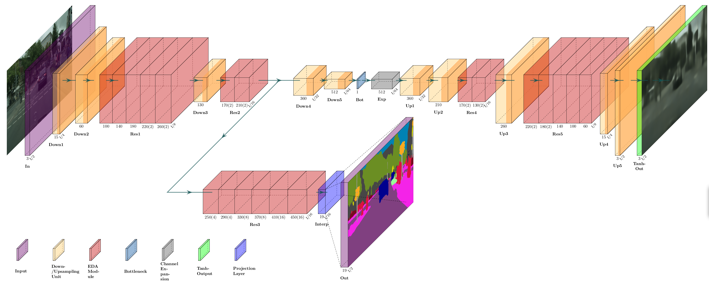
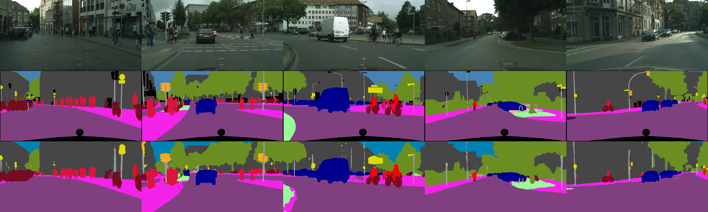

# README #




### Introduction ###

This repository contains the code and models of the master thesis "Efficient Multi-Head Architecture for Real-Time Simultaneous Edge-Case Detection and Semantic Segmentation for Autonomous Driving"
to reproduce the results of EDANetMHA4 and it's 
semantic segmentation EDANet and autoencoder EDANetAE counterpart. 

### Project Structure ### 

```python
├─architectures
│ ├─autoencoders
│ │ ├─conv_ae.py    # baseline convolutional autoencoder 
│ │ ├─dabnet_ae.py  # DABNetAE autoencoder
│ │ ├─edanet_ae.py  # EDANetAE autoencoder
│ │ ├─erfnet_ae.py  # ERFNetAE autoencoder
│ │ ├─fastscnn_ae.py    # FastSCNNAE autoencoder
│ │ ├─lednet_ae.py  # LEDNetAE autoencoder
│ ├─mha
│ │ ├─multihead_net_1.py    # EDANet_MHA1
│ │ ├─multihead_net_2.py    # EDANet_MHA2
│ │ ├─multihead_net_3.py    # EDANet_MHA3
│ │ ├─multihead_net_4.py    # EDANet_MHA4
│ ├─semantic_segmentation
│ │ ├─dabnet.py     # DABNet semantic segmentation
│ │ ├─edanet.py     # EDANet semantic segmentation
│ │ ├─erfnet.py     # ERFNet semantic segmentation
│ │ ├─fastscnn.py   # FastSCNN semantic segmentation
│ │ ├─lednet.py     # LEDNet semantic segmentation
│ ├─__init__.py     # parent link for config file 
│ ├─common_blocks.py    # the modified residual modules 
│ ├─encoders.py         # the encoders of the chosen semseg models
│ ├─pyramid_pooling.py  # pyramid pooling functionality
│ ├─test_model.py       # testing script for the models
├─configs
│ ├─autoencoder_setup.yml   # setup config for single-head autoencoder
│ ├─mha_setup.yml           # setup config for MHA
│ ├─model_setup.yml         # model config setup (state model and cityscapes)
│ ├─semseg_setup.yml        # setup config for single-head semantic segmentation
├─final_models
│ ├─edanet.pth      # weights of EDANet
│ ├─edanet_ae.pth   # weights of EDANetAE
│ ├─edanet_mha4.pth # weights of EDANetMHA4
├─loaders
│ ├─__init__.py     # parent link for config file 
│ ├─cityscapes.py       # cityscapes dataset loader script
├─losses
│ ├─__init__.py     # parent link for config file (default losses from PyTorch stated here)
│ ├─loss_mha.py     # loss balancing approach functionality for the MHA
├─optimisers
│ ├─__init__.py     # parent link for config file (default optims from PyTorch stated here)
│ ├─scheduler.py    # learning rate scheduler functionality
├─transforms
│ ├─__init__.py     # parent link for config file
│ ├─augments.py     # augmentation implementations 
├─utils
│ ├─logger.py       # implementation for early stopping
│ ├─plots.py        # visualisation helper classes for evaluation results
│ ├─results_plotting.py     # matplotlib functions for autoencoder ablative experiments
│ ├─semseg_metrics.py        # helper functions to get mIoU
│ ├─utils.py        # general helper functions
├─requirements.txt      # required pre-requisite packages
├─eval.py           # single-head evaluation of model script
├─train.py          # single-head training script
├─test.py           # single-head evaluation of results script
├─train_mha.py      # multi-head training script
├─test_mha.py       # multi-head evaluation of results script
├─visualise.py      # helper classes for t-SNE and feature map visualisations
```

### Pre-requisite ###
* Run ```pip install -r requirements.txt```
* [The Cityscapes dataset](https://www.cityscapes-dataset.com/) - Download and state the root location in [model_setup.yml]
* Python - Version 3 or higher

### Training ###
* Set up the training parameters in [mha_setup.yml] and [model_setup.yml]
* Begin training ```python3 test_mha.py
        --setup_config_path PATH_TO_[mha_setup.yml]
        --model_config_path PATH_TO_[model_setup.yml] ```

### Evaluation
* Set up the evaluation parameters in [mha_setup.yml] and [model_setup.yml]
* Begin evaluation 
```python3 train_mha.py- -setup_config_path PATH_TO_[mha_setup.yml] --model_config_path PATH_TO_[model_setup.yml] ```

### Results and Visualisations

#### Semantic Segmentation Result



#### Autoencoder Result


#### MTL vs STL accuracy comparisons

| Model Type | Model         | Seg Val Loss | Mean IoU (%) | Autoencoder Val Loss | MTL_delta (%) |
|------------|---------------|--------------|--------------|----------------------|---------------|
| STL        | `EDANetAE`    | -            | -            | 0.02529              | + 0.00        |
| STL        | `EDANet`      | 0.27304      | 62.6         | -                    | + 0.00        |
| MTL        | `EDANet-MHA4`  | 0.26986      | 62.27        | 0.02668              | -2.16         |

#### MTL vs STL computational comparisons

| Model Type | Model              | Parameters | GFLOPs | FPS    | MTL_delta (%) |
|------------|--------------------|------------|--------|--------|---------------|
| STL        | `EDANetAE`         | 3.221      | 38.12  | 45.49  | + 0.00        |
| STL        | `EDANet`           | 0.689      | 8.88   | 113.71 | + 0.00        |
| STL        | `EDANetAE + EDANet` | 3.911      | 47     | 34.72  | +0.00         |
| MTL        | `EDANet-MHA4`      | 2.732      | 30.79  | 64.36  | +50.06        |


### Licensing

Attribution-NonCommercial-ShareAlike 4.0 International (CC BY-NC-SA 4.0)
This is a human-readable summary of (and not a substitute for) the license. Disclaimer.
You are free to:
Share — copy and redistribute the material in any medium or format
Adapt — remix, transform, and build upon the material
The licensor cannot revoke these freedoms as long as you follow the license terms.
Under the following terms:
Attribution — You must give appropriate credit, provide a link to the license, and indicate if changes were made. You may do so in any reasonable manner, but not in any way that suggests the licensor endorses you or your use.

NonCommercial — You may not use the material for commercial purposes.

ShareAlike — If you remix, transform, or build upon the material, you must distribute your contributions under the same license as the original.

No additional restrictions — You may not apply legal terms or technological measures that legally restrict others from doing anything the license permits.
Notices:
You do not have to comply with the license for elements of the material in the public domain or where your use is permitted by an applicable exception or limitation.
No warranties are given. The license may not give you all of the permissions necessary for your intended use. For example, other rights such as publicity, privacy, or moral rights may limit how you use the material.